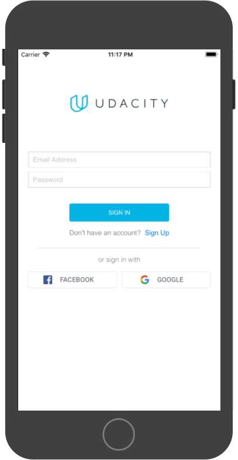
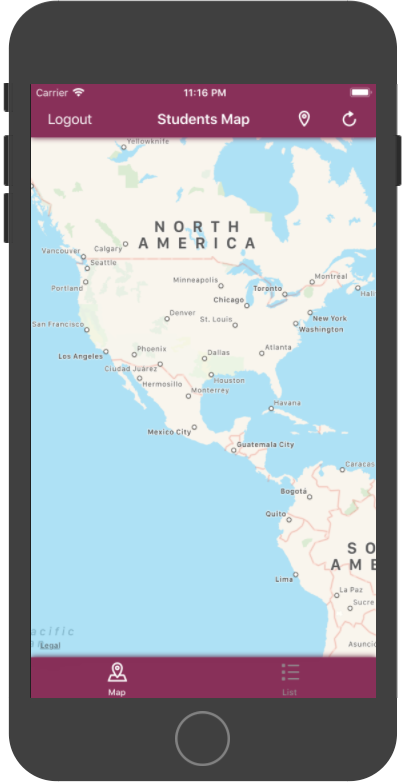

# Portfolio Sample iOS App: On The Map

An app to share a location on the map and a link with fellow Udacians.
- OAuth based Google & FB Sign In.
- Networking code in this portfolio app doesn't rely on any 3rd party libraries like Alamofire.
- Adaptive layout. Any orientation at any size.
- Uses [PureLayout](https://github.com/PureLayout/PureLayout) to programmatically auto-layout.
- Works on any device running iOS 10.

## Output

## Requirements

- Built with Swift 3.3 and Xcode 9.3.1.
- CocoaPods
- Not required but design assets managed by PaintCode.

## How to build
- Open the .xcworkspace file (not .xcodeproj file)

### For simulator
- Build

### For device
- Open the project settings by clicking on the Project in the Project Navigator on the left side.
- Select the "OnTheMap" target.
- In General (tab) -> Identity (section) change the bundle identifier to your own bundle identifier.
- Build

